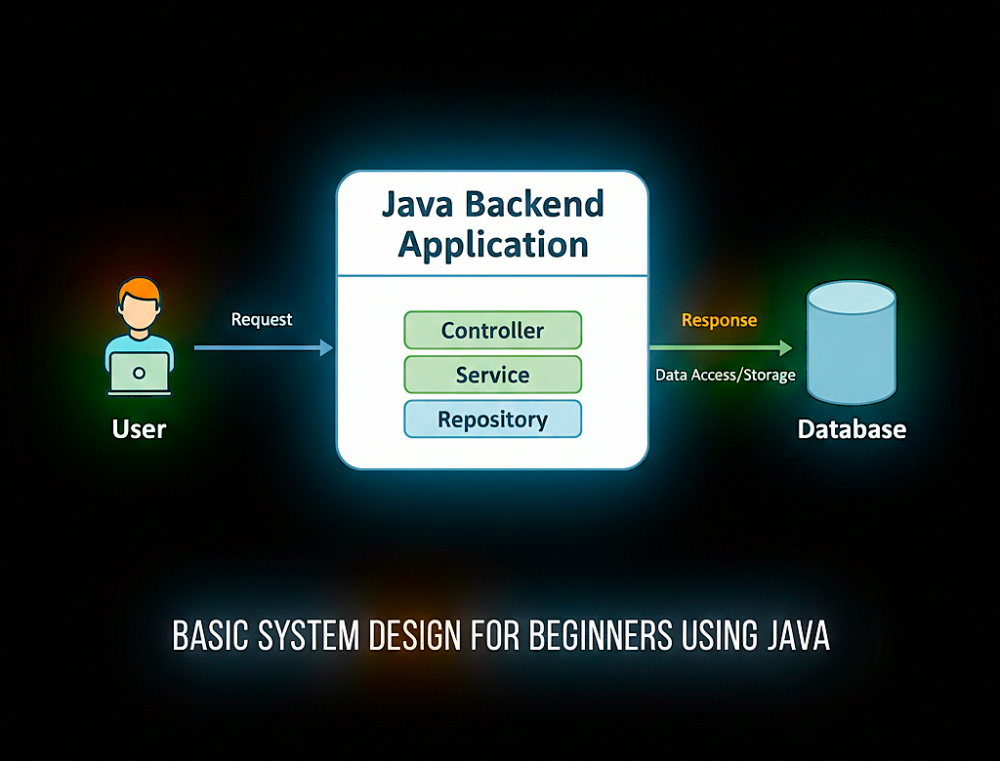

# 📘 Day 01 – What is System Design?

### _A Beginner-Friendly Introduction for Java Developers_

---

---

## 🎯 Objective of Day 01

The goal of this day is to build the **right mindset** for system design.

Before learning APIs, databases, or scalability, it’s important to understand:

- What system design actually means
- Why it matters in real Java applications
- How small applications are also “systems”

This foundation makes the next 9 days easy and logical.

---

## 🧠 What is System Design?

**System Design is the process of planning how different parts of a software application work together.**

It focuses on:

- What components exist
- What responsibility each component has
- How data flows between components

System design answers _“How does the system work as a whole?”_  
—not _“How do I write this line of code?”_

---

## 🏗️ Why System Design Matters

In real-world software development:

- Code is written once
- Systems are maintained for years
- Changes happen frequently

Without system design:

- Code becomes hard to change
- Bugs increase
- Scaling becomes painful

With system design:

- Applications stay organized
- Responsibilities are clear
- Teams can work together effectively

---

## ☕ System Design from a Java Perspective

Even a basic Java backend application is a system.

A typical Java (Spring Boot) application follows this flow:

User → Controller → Service → Repository → Database

Each layer has a **clear responsibility**:

- **Controller**: handles requests
- **Service**: business logic
- **Repository**: database interaction
- **Database**: data storage

Understanding this structure is **system design at a beginner level**.

---

## 🖼️ Visual Overview (Beginner System)

The diagram below represents a simple Java backend system:

➡️ User sends a request  
➡️ Java backend processes it  
➡️ Database stores or returns data  
➡️ Response goes back to user

📌 Image file location:
Day-01/system-design-basics.png

This request–response flow exists in almost every backend system.

---

## 🎤 Interview Perspective (Beginner Level)

**Q: What is system design?**  
**A:** System design is about structuring software components and defining how they interact to solve a problem.

**Q: Is system design only for large systems?**  
**A:** No. Even small Java applications need basic system design.

**Q: Should beginners learn system design?**  
**A:** Yes. Beginners focus on clarity and fundamentals, not large-scale complexity.

---

## ⚠️ Common Beginner Mistakes

- Assuming system design means microservices
- Using buzzwords without understanding
- Thinking only large companies need design
- Ignoring application structure
- Jumping into scalability too early

---

## 📝 Quick Notes (For Revision)

- System design = planning before coding
- Even small apps are systems
- Focus on flow, not tools
- Think in boxes and arrows
- Java apps already follow system design principles

---

## ✅ Day 01 Takeaways

After Day 01, you should be able to:

- Explain system design in simple terms
- Identify components in a Java application
- Understand basic request–response flow
- Feel confident starting system design learning

---

## ⏭️ What’s Next?

### 👉 **Day 02 – Client–Server Architecture**

Learn how:

- Clients and servers communicate
- Requests travel over the network
- Java backend acts as a server

 

[➡️ Go to Day 02](../Day-02/README.md)

---
