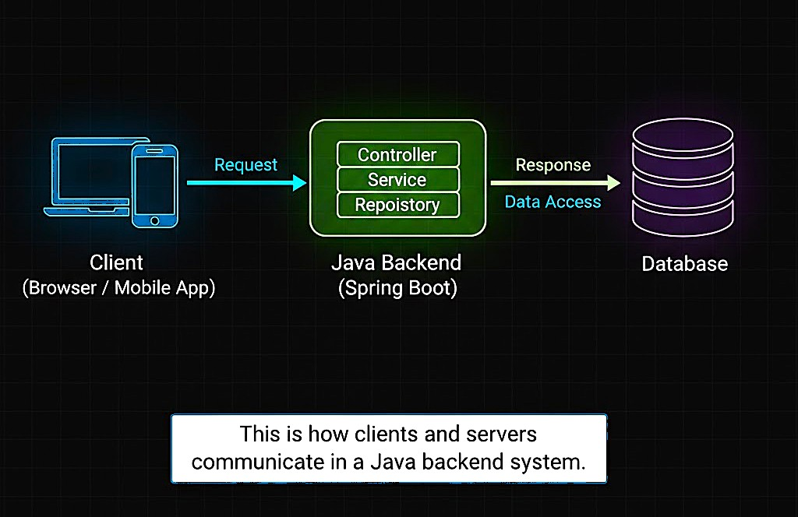

# 📘 Day 02 – Client–Server Architecture

### _How Applications Communicate in the Real World (Java View)_

---

---

## 🎯 Objective of Day 02

The goal of Day 02 is to understand **how users and backend applications communicate**.

Today you will learn:

- What a client is
- What a server is
- How requests and responses work
- Where a Java backend fits in this model

This is the **foundation of all backend development**.

---

## 🧠 What is Client–Server Architecture?

**Client–Server Architecture** is a model where:

- A **client** requests something
- A **server** processes that request
- The server sends a response back

They are separate and have **different responsibilities**.

---

## 👤 What is a Client?

A **client** is the part that:

- Sends requests
- Takes user input
- Displays responses

Common examples:

- Web browser (Chrome, Firefox)
- Mobile apps
- Frontend applications (React, Angular)

📌 Clients **do not store business logic**.

---

## 🖥️ What is a Server?

A **server** is the part that:

- Receives requests
- Applies business logic
- Talks to databases
- Sends responses

In our context:
👉 **Java backend application = Server**

Examples:

- Java Spring Boot app
- Node.js backend
- Python backend

---

## ☕ Client–Server from a Java Perspective

In a Java backend system:

Client (Browser / App)
↓
Java Backend (Spring Boot)
↓
Database

Flow:

1. Client sends HTTP request
2. Java server processes request
3. Server interacts with database
4. Server sends response back to client

This is how **most real-world Java applications work**.

---

## 🖼️ Visual Overview

The diagram below represents a basic client–server system:

➡️ Client sends request  
➡️ Server processes it  
➡️ Server accesses database  
➡️ Response returns to client

This architecture is:

- Simple
- Reliable
- Easy to scale later

---

## 🔄 Request–Response Lifecycle (Beginner View)

Client → Request → Server
Client ← Response ← Server

Important points:

- Client **waits** for response
- Server handles **multiple clients**
- Communication usually happens via **HTTP**

---

## 🎤 Interview Perspective (Beginner Level)

**Q: What is client–server architecture?**  
**A:** It is an architecture where clients request services and servers process and respond to those requests.

---

**Q: Is the database a client or server?**  
**A:** The database acts as a server to the backend application.

---

**Q: Can one server handle multiple clients?**  
**A:** Yes. Servers are designed to handle many client requests.

---

**Q: In Java applications, what acts as the server?**  
**A:** The Java backend application (e.g., Spring Boot).

---

## ⚠️ Common Beginner Mistakes

- Thinking client and server are the same
- Putting business logic in the client
- Assuming server serves only one client
- Ignoring request–response flow
- Confusing frontend with backend

---

## 📝 Quick Notes (For Revision)

- Client requests, server responds
- Java backend = server
- Clients handle UI
- Servers handle logic & data
- HTTP is the communication medium

---

## ✅ Day 02 Takeaways

After Day 02, you should be able to:

- Clearly explain client vs server
- Describe request–response flow
- Identify Java’s role as a server
- Understand how real apps communicate

---

## ⏭️ What’s Next?

### 👉 **Day 03 – Monolith vs Layered Architecture (Java Apps)**

Learn:

- How Java applications are structured internally
- Why layers exist
- How monolithic Java apps work

 

[➡️ Go to Day 03](../Day-03/README.md)

---
