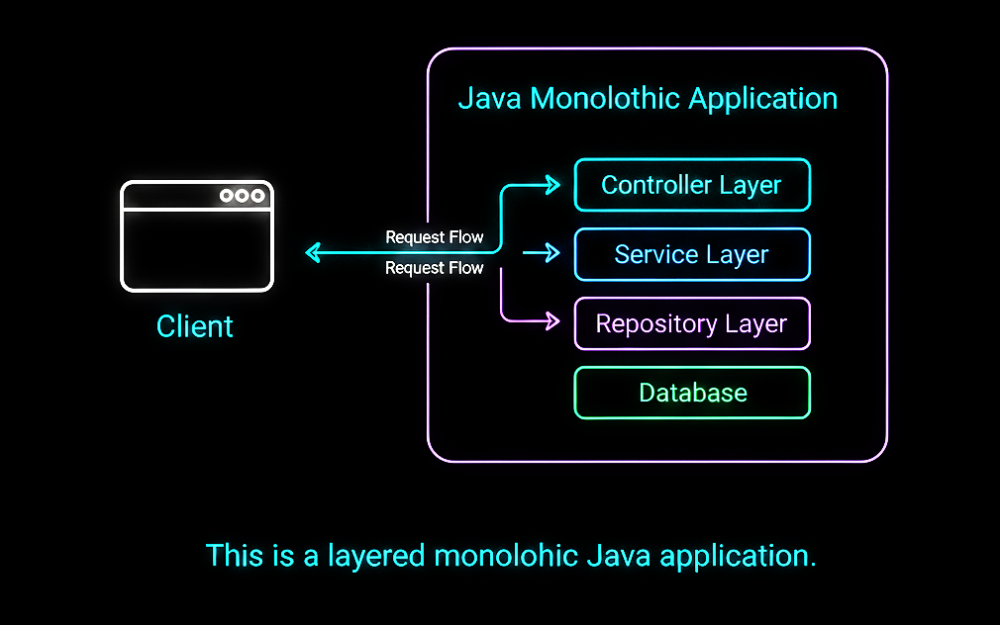

# 📘 Day 03 – Monolith vs Layered Architecture

### _How Java Applications Are Structured Internally_

---

---

## 🎯 Objective of Day 03

The goal of Day 03 is to understand **how a Java application is organized internally**.

Today you will learn:

- What a monolithic application is
- What layered architecture means
- Why most Java backend applications are layered monoliths

This knowledge is essential before learning APIs, databases, and scalability.

---

## 🧠 What is a Monolithic Application?

A **monolithic application** is a single application where:

- All features live in one codebase
- The application is built and deployed as one unit
- Components are tightly connected

📌 Most beginner and intermediate Java applications are **monoliths**.

---

## 🧱 What is Layered Architecture?

**Layered Architecture** is a way to organize code inside a monolithic application.

Each layer has a **specific responsibility**.

Typical Java layers:

Controller Layer
Service Layer
Repository Layer
Database

Even though the app is monolithic, **layers keep it clean and manageable**.

---

## ☕ Monolith + Layers in Java (Very Important)

Most real-world Java backend apps are:

> **Layered Monolithic Applications**

Meaning:

- One deployable application (monolith)
- Internally divided into layers

Example structure:

com.example.app
├── controller
├── service
├── repository
└── model

This is **not microservices**.  
This is **clean monolithic design**.

---

## 🖼️ Visual Overview

The diagram below shows a layered monolithic Java application:

➡️ All layers exist inside one application  
➡️ Requests flow from top to bottom  
➡️ Each layer has a clear responsibility

📌 Image file location:
Day-03/monolith-layered-architecture.png

---

## 🔄 Request Flow in a Layered Java App

Client
↓
Controller
↓
Service
↓
Repository
↓
Database

Rules to remember:

- Controllers should not talk directly to database
- Business logic belongs in service layer
- Repository handles data access only

---

## 🎤 Interview Perspective (Beginner Level)

**Q: What is a monolithic application?**  
**A:** A monolithic application is built and deployed as a single unit.

---

**Q: What is layered architecture?**  
**A:** It is a design pattern that organizes code into layers with specific responsibilities.

---

**Q: Are monoliths bad?**  
**A:** No. Layered monoliths are simple, stable, and ideal for many applications.

---

**Q: How are most Java applications designed?**  
**A:** As layered monolithic applications.

---

## ⚠️ Common Beginner Mistakes

- Thinking monolith means bad design
- Jumping to microservices too early
- Mixing responsibilities between layers
- Writing database logic in controllers
- Overengineering small applications

---

## 📝 Quick Notes (For Revision)

- Monolith = single deployable app
- Layers = internal organization
- Java apps commonly use layered architecture
- Clean separation improves maintainability

---

## ✅ Day 03 Takeaways

After Day 03, you should be able to:

- Explain monolith vs layered architecture
- Describe Java application structure
- Identify responsibilities of each layer
- Answer basic architecture interview questions

---

## ⏭️ What’s Next?

### 👉 **Day 04 – REST APIs & Request Flow**

Learn:

- What REST APIs are
- How requests move through layers
- How Java handles HTTP requests

 

[➡️ Go to Day 04](../Day-04/README.md)

---
