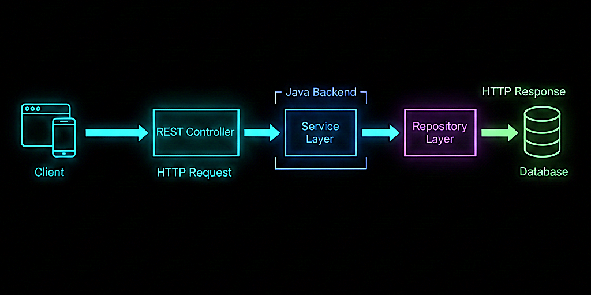

# 📘 Day 04 – REST APIs & Request Flow

### _How Requests Travel Through a Java Backend_

---

---

## 🎯 Objective of Day 04

The goal of Day 04 is to understand **how requests actually move through a backend system**.

Today you will learn:

- What REST APIs are
- How HTTP requests work
- How a request flows through Java layers
- How controllers, services, and repositories interact

This is **core backend knowledge** and very interview-relevant.

---

## 🧠 What is a REST API?

A **REST API** is a way for clients to communicate with servers using **HTTP requests**.

REST stands for:
**Representational State Transfer**

In simple terms:

> A REST API defines **how a client asks for data and how the server responds**.

---

## 🌐 HTTP Basics (Beginner View)

REST APIs commonly use HTTP methods:

- **GET** → fetch data
- **POST** → create data
- **PUT** → update data
- **DELETE** → remove data

Each request:

- Goes to a specific URL
- Uses an HTTP method
- Gets a response from the server

---

## ☕ REST APIs from a Java Perspective

In Java backend applications (Spring Boot):

- REST APIs are handled by **Controllers**
- Each API maps to a method
- Controllers delegate logic to services

Example flow:

Client
↓
REST Controller
↓
Service Layer
↓
Repository
↓
Database

📌 Controllers should not contain business logic.

---

## 🖼️ Visual Overview

The diagram below represents a REST API request flow in a Java backend:

➡️ Client sends HTTP request  
➡️ Controller receives request  
➡️ Service processes logic  
➡️ Repository accesses database  
➡️ Response flows back to client

📌 Image file location:
Day-04/rest-api-request-flow.png

---

## 🔄 Step-by-Step Request Flow

1. Client sends an HTTP request (GET /users)
2. Controller receives the request
3. Service applies business logic
4. Repository interacts with database
5. Response is returned to client

This flow remains **almost identical in most Java backend systems**.

---

## 🎤 Interview Perspective (Beginner Level)

**Q: What is a REST API?**  
**A:** A REST API allows clients to communicate with servers using HTTP methods.

---

**Q: Where is REST implemented in Java apps?**  
**A:** In controller classes.

---

**Q: Should controllers contain business logic?**  
**A:** No. Business logic belongs in the service layer.

---

**Q: What happens after a controller receives a request?**  
**A:** It delegates processing to the service layer.

---

## ⚠️ Common Beginner Mistakes

- Putting logic directly in controllers
- Confusing REST with frontend
- Not understanding request flow
- Treating APIs as magic endpoints
- Ignoring HTTP methods

---

## 📝 Quick Notes (For Revision)

- REST APIs use HTTP
- Controllers handle requests
- Services handle logic
- Repositories handle data
- Request flow is top to bottom

---

## ✅ Day 04 Takeaways

After Day 04, you should be able to:

- Explain REST APIs simply
- Describe HTTP request flow
- Understand Java controller responsibility
- Answer REST-related interview questions

---

## ⏭️ What’s Next?

### 👉 **Day 05 – Databases (SQL vs NoSQL Basics)**

Learn:

- Why databases are needed
- Difference between SQL and NoSQL
- How Java apps interact with databases

 

[➡️ Go to Day 05](../Day-05/README.md)

---
