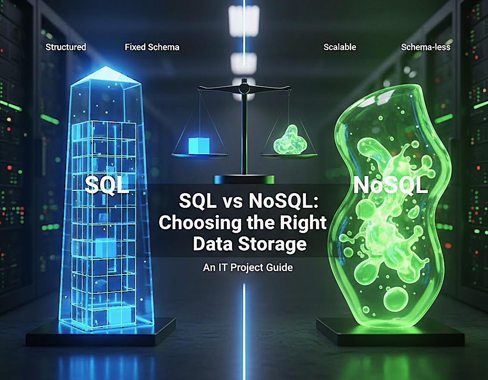

# 📅 Day 05 — Databases (SQL vs NoSQL Basics)

### Making the Right Data Storage Decision

Understanding <b>where</b> and <b>how</b> data is stored is a core system design skill. 
Today we learn how beginners should think about <b>SQL vs NoSQL</b> — without confusion.

---

## 🧠 Why Databases Matter in System Design

In system design, databases decide:

- How fast your system responds
- How safely data is stored
- How well your system scales
- How complex your backend becomes

> ❗ Bad database choice = performance issues + redesign later

---

## 🗄️ What is a Database?

A **database** is a system that:

- Stores data
- Retrieves data efficiently
- Maintains consistency and reliability

In system design, we mostly choose between:

- **SQL databases**
- **NoSQL databases**

---

## 🟦 SQL Databases (Relational)

### 🧠 One-Line Definition

SQL databases store data in **tables with fixed structure and relationships**.

### 🔑 Key Characteristics

- Tables (rows & columns)
- Fixed schema
- ACID properties
- Strong consistency

### 📌 Common Examples

- MySQL
- PostgreSQL
- Oracle

### 🧩 Where SQL Fits Best

- Banking systems
- College / ERP systems
- Inventory & billing apps

---

## 🟩 NoSQL Databases (Non-Relational)

### 🧠 One-Line Definition

NoSQL databases store data in **flexible formats** for scalability.

### 🔑 Key Characteristics

- No fixed schema
- Horizontally scalable
- High availability
- Flexible data models

### 📌 Common Types

- Document (MongoDB)
- Key-Value (Redis)
- Column (Cassandra)

### 🧩 Where NoSQL Fits Best

- Social media apps
- Chat applications
- Real-time analytics

---

## ⚖️ SQL vs NoSQL — Beginner Comparison

| Feature        | SQL      | NoSQL                 |
| -------------- | -------- | --------------------- |
| Schema         | Fixed    | Flexible              |
| Structure      | Tables   | Documents / Key-Value |
| Scaling        | Vertical | Horizontal            |
| Consistency    | Strong   | Eventual              |
| Learning Curve | Easy     | Moderate              |

---

## 🧠 Beginner Rule (VERY IMPORTANT)

> ✅ **Start with SQL unless you clearly need NoSQL**

Why?

- SQL is easier to reason about
- Data relationships are clear
- Interviews expect SQL first

NoSQL is used **when scale & flexibility matter more than structure**.

---

## 🎯 Interview Perspective

### ❌ Wrong Answer

> “NoSQL is better because it is faster.”

### ✅ Correct Beginner Answer

> “SQL is preferred for structured data, NoSQL for scalability and flexibility.”

---

## 📊 Daily Outcome

By the end of Day 05, you can:

✅ Explain what a database is  
✅ Differentiate SQL vs NoSQL  
✅ Justify database choice at beginner level  
✅ Avoid overengineering in interviews

---

## 📘 Notes & Deep Dive

➡️ **Read detailed explanations:** [`notes.md`](./notes.md)

---

## ⏭️ What’s Next?

### 👉 **Next Day — Day 06 (SQL vs NoSQL Basics)**

 

[➡️ Go to Day 06](../Day-06/README.md)

Learn:

### 🔹 Scalability Basics

- Vertical vs Horizontal Scaling
- Growth mindset for system design
- Why “don’t scale too early” matters
   

> 💡 _Good system design is about correct decisions, not complex tools._

---
