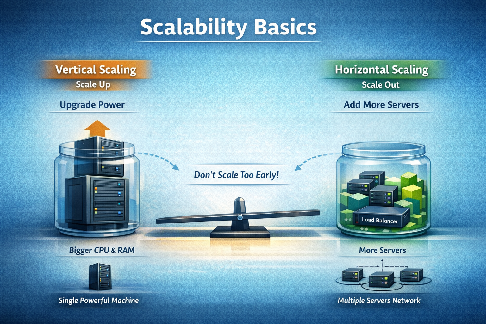

# 📅 Day 06 — Scalability Basics

### Understanding How Systems Handle Growth

Scalability is about preparing your system for <b>growth</b>. 
Today we learn how systems handle increasing users — without overengineering.

---

## 🧠 Why Scalability Matters

Every system starts small.

But questions begin when:

- Users increase
- Traffic spikes
- Data grows
- Requests become heavy

> ❗ If your system cannot handle growth, it will slow down or crash.

Scalability ensures:

- Stability
- Performance
- Long-term sustainability

---

## 📈 What is Scalability?

### 🧠 One-Line Definition

Scalability is the ability of a system to **handle increasing load without breaking or slowing down significantly**.

In simple terms:

> More users → System still works smoothly.

---

## 🔼 Vertical Scaling (Scale Up)

### 🧠 One-Line Definition

Increasing the **power of a single server**.

### 🔧 How?

- More CPU
- More RAM
- Better hardware

### 📌 Example

Upgrading from:

- 8GB RAM → 32GB RAM

### ✅ Advantages

- Simple to implement
- No architecture change required

### ❌ Limitations

- Hardware has limits
- Expensive upgrades
- Single point of failure

---

## 🔁 Horizontal Scaling (Scale Out)

### 🧠 One-Line Definition

Adding **more servers** to distribute load.

### 🔧 How?

Instead of 1 powerful server → use multiple servers.

### 📌 Example

1 Server → 3 Servers → 10 Servers

### ✅ Advantages

- High availability
- Better fault tolerance
- Handles large traffic

### ❌ Challenges

- Requires load balancer
- More complex setup

---

## ⚖️ Vertical vs Horizontal — Quick Comparison

| Feature          | Vertical Scaling   | Horizontal Scaling   |
| ---------------- | ------------------ | -------------------- |
| Method           | Increase power     | Increase number      |
| Cost             | Expensive hardware | Infrastructure setup |
| Complexity       | Simple             | Moderate             |
| Fault Tolerance  | Low                | High                 |
| Long-Term Growth | Limited            | Strong               |

---

## 🧠 Beginner Rule (VERY IMPORTANT)

> ✅ Don’t scale too early.

Most beginner projects:

- Don’t need multiple servers
- Don’t need distributed systems
- Don’t need microservices

Start simple.
Scale only when real load appears.

---

## 🎯 Interview Perspective

### ❌ Wrong Answer

> “We should always use horizontal scaling.”

### ✅ Correct Beginner Answer

> “Start with vertical scaling. Move to horizontal when traffic demands it.”

This shows practical thinking.

---

## 🏢 Real-Life Analogy

Imagine a restaurant:

**Vertical Scaling**
→ Making one kitchen bigger.

**Horizontal Scaling**
→ Opening more branches.

Both solve growth — but in different ways.

---

## 📊 Daily Outcome

By the end of Day 06, you can:

✅ Define scalability clearly  
✅ Explain vertical vs horizontal scaling  
✅ Give real-world analogy  
✅ Avoid overengineering in interviews

---

## 📘 Notes & Deep Dive

➡️ **Read detailed explanations:** [`notes.md`](./notes.md)

---

## ⏭️ Next Day — Day 07

### 🔹 Caching (Why & Where)

- Speed improvement basics
- Where to place cache
- Common misconceptions

 

[➡️ Go to Day 07](../Day-07/README.md)

> 💡 _Good system design grows gradually, not dramatically._
