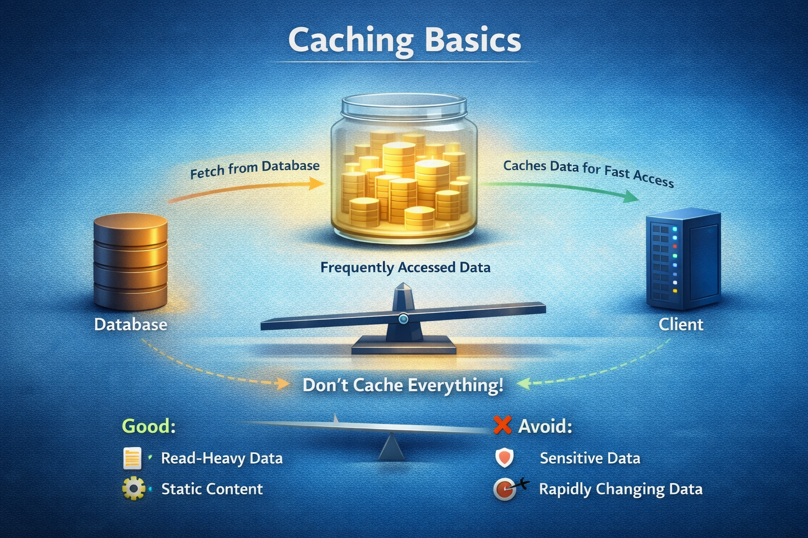

# 📅 Day 07 — Caching (Why & Where)

### Making Systems Faster the Smart Way

Caching improves system performance by storing <b>frequently accessed data</b>. 
Today we learn where to use cache — and where NOT to.

---

## 🧠 Why Caching Matters

As systems grow:

- Database queries increase
- Response time slows
- Server load rises

If every request hits the database:

- Performance suffers
- Costs increase
- Users experience delays

> ❗ Caching reduces repeated work.

---

## ⚡ What is Caching?

### 🧠 One-Line Definition

Caching is storing frequently accessed data in a **fast-access storage layer** to reduce repeated processing.

In simple terms:

> Instead of calculating again, reuse stored results.

---

## 📦 Basic Caching Flow

Client → Server → Cache → Database

If data exists in cache:
→ Return immediately

If not:
→ Fetch from database  
→ Store in cache  
→ Return response

---

## 🧩 Where to Use Cache

### ✅ Good Candidates

- Frequently requested data
- Product listings
- User session data
- Static configuration
- API responses with high traffic

---

### ❌ Avoid Caching When

- Data changes very frequently
- Strong real-time consistency is required
- Security-sensitive temporary data

---

## 🔁 Cache Placement Options

1️⃣ Application Level Cache  
2️⃣ Distributed Cache (Redis etc.)  
3️⃣ CDN (for static files)

---

## ⚖️ With Cache vs Without Cache

| Without Cache         | With Cache                      |
| --------------------- | ------------------------------- |
| Every request hits DB | Many requests served from cache |
| Higher latency        | Lower latency                   |
| Higher DB load        | Reduced DB load                 |
| Slower under traffic  | Faster under traffic            |

---

## 🧠 Beginner Rule (VERY IMPORTANT)

> ✅ Do not cache everything.

Bad caching decisions can:

- Serve outdated data
- Increase memory usage
- Cause inconsistency issues

Cache only what:

- Is read-heavy
- Changes infrequently
- Benefits from speed boost

---

## 🎯 Interview Perspective

### ❌ Wrong Answer

> “We should cache all database queries.”

### ✅ Correct Beginner Answer

> “Cache frequently accessed, read-heavy data to reduce load and improve response time.”

---

## 🏢 Real-Life Analogy

Think of a teacher answering the same question 100 times.

Without cache:
Teacher explains every time.

With cache:
Teacher writes answer on board once.

Students read from board.

Same logic.
Less repeated work.

---

## 📊 Daily Outcome

By the end of Day 07, you can:

✅ Define caching clearly  
✅ Explain cache flow  
✅ Identify where to use cache  
✅ Avoid common beginner mistakes  
✅ Give interview-safe answers

---

## 📘 Notes & Deep Dive

➡️ **Read detailed explanations:** [`notes.md`](./notes.md)

---

## ⏭️ Next Day — Day 08

### 🔹 Load Balancer (Conceptual)

- How traffic is distributed
- Why multiple servers matter
- Beginner-safe explanation

> 💡 _Speed optimization is about reducing unnecessary work._
