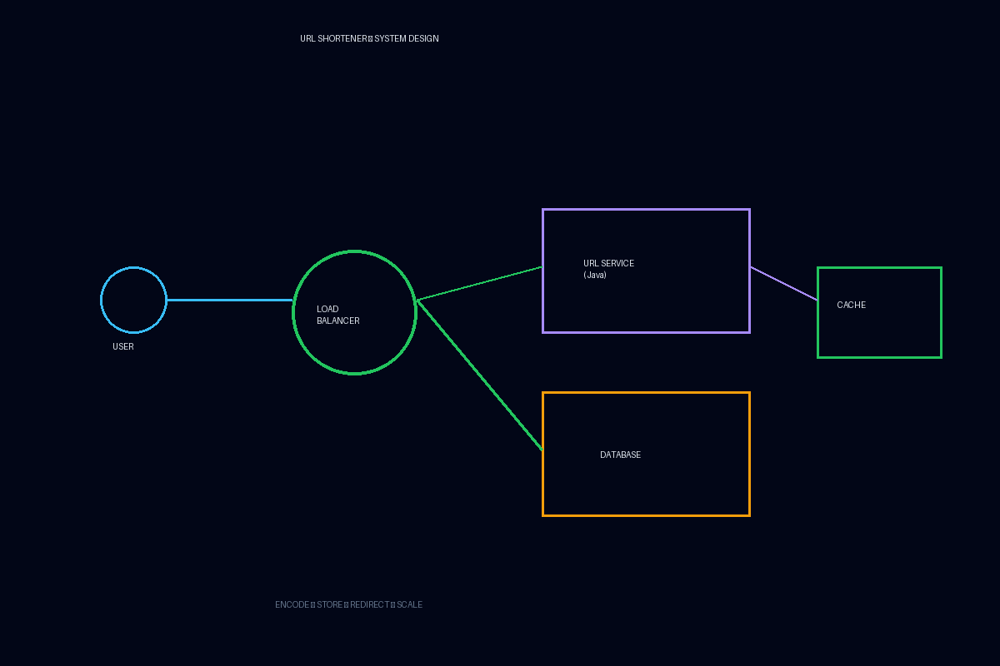

# 🔗 Day 09 – Beginner System Design: URL Shortener

  

---

## 🎯 Core Goal

Design a **simple and scalable URL Shortener** like:

- bit.ly
- tinyurl

At beginner level — **clear thinking > complex scaling**

---

## 🧠 Why This Matters

This is your **first complete system design** where you learn:

✔ How to understand requirements  
✔ How to think in components  
✔ How to design step-by-step  
✔ How to explain in interviews

This day converts:

> ❌ Theory → ✅ Real system thinking

---

## 🏗️ Step 1 – Understand the Requirements

### ✅ Functional Requirements

- User submits a long URL
- System returns a short URL
- Visiting short URL redirects to original URL

---

### ✅ Non-Functional (Beginner Level)

- Fast redirection
- Scalable for many users
- Highly available

---

## 🧩 High-Level Architecture

Client
↓
Load Balancer
↓
URL Shortener Service
↓
Database

yaml
Copy code

---

## ⚙️ Core Components

### 1️⃣ Client

- Browser / Mobile app
- Sends request

---

### 2️⃣ Load Balancer

Distributes traffic across multiple app servers.

---

### 3️⃣ Application Service (Java – Spring Boot)

Responsible for:

✔ Generating short URL  
✔ Storing mapping  
✔ Redirecting users

---

### 4️⃣ Database

Stores:

shortCode → originalURL

yaml
Copy code

---

## 🔄 Request Flow

### ➤ URL Shortening

POST /shorten

Long URL → Service → Generate Code → Store → Return short URL

yaml
Copy code

---

### ➤ Redirection

GET /abc123

Read from DB → Fetch original URL → Redirect

yaml
Copy code

---

## ☕ Java Perspective

In real projects:

### Controller

Handles HTTP request.

### Service

Contains business logic:

- Generate short code
- Save mapping

### Repository

Talks to database.

---

## 🧠 Short Code Generation (Beginner Safe)

We avoid complex hashing.

Use:

- Auto-increment ID
- Convert to Base62

Example:

ID: 125 → Base62 → "cb"

yaml
Copy code

---

## 🗄️ Database Design

### Table: url_mapping

| short_code | original_url |
| ---------- | ------------ |
| abc123     | google.com   |

---

## ⚡ Performance Improvement (Concept Only)

### 1️⃣ Caching

Popular URLs stored in cache.

Why?

Because redirection is read-heavy.

---

### 2️⃣ Stateless Services

Multiple instances behind load balancer.

---

## 🖼️ System Design Diagram

markdown
Copy code
┌──────────────┐
User ─────────► │ Load Balancer│
└──────┬───────┘
│
┌──────────────┐
│ URL Service │
└──────┬───────┘
│
┌─────────┐
│Database │
└─────────┘

yaml
Copy code

---

## 💬 Interview-Style Explanation (Golden Answer)

> “User sends a long URL → load balancer routes the request → stateless Java service generates a short code → mapping is stored in database → short URL is returned.  
> When the short URL is accessed, we fetch the original URL and redirect the user.”

This is **perfect beginner system design delivery**.

---

## 🚨 Common Beginner Mistakes

❌ Starting with microservices  
❌ Over-thinking scalability  
❌ Designing distributed ID generators  
❌ Ignoring read-heavy nature

---

## 🧠 Interview Secret

Always say:

> “This is a read-heavy system, so caching frequently accessed URLs will improve performance.”

That sounds **very strong for a beginner**.

---

## 🏁 What You Can Do After Today

You can now:

✔ Walk through a full system design  
✔ Identify components  
✔ Explain request flow  
✔ Think in scalability terms

You are no longer a theory learner.

You are a **system designer (beginner level)**.

---

## 📈 Progress Unlock

✅ First end-to-end design completed  
✅ Real interview confidence boost  
✅ Architecture thinking activated

---

## 🔜 Next Step

➡️ **Day 10 – How Java Fits in Real-World System Design**

Where everything connects to your career path 🚀
