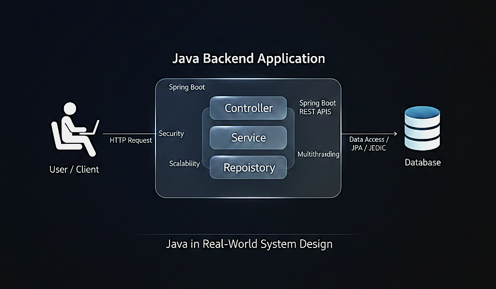

# ☕ Day 10 – How Java Fits in Real-World System Design

  

---

## 🎯 Core Goal

Understand:

> Where Java actually lives in real scalable systems.

Not theory.  
Not buzzwords.  
**Real production role.**

---

## 🧠 Why This Day Is Important

Till now you learned:

- Client–Server
- Layers
- APIs
- DB
- Caching
- Scaling
- Load Balancer
- Full System Design

Now we connect everything to:

> ☕ Your Java Backend Career

---

## 🌍 Real-World System View

Client → CDN → Load Balancer → Java Backend → Cache → Database → Message Queue → Other Services

yaml
Copy code

Java lives here:

Inside the Backend Services

yaml
Copy code

It is the **brain of the system** 🧠

---

## 🏗️ Responsibilities of Java in Production

### 1️⃣ API Layer

Using:

- Spring Boot

Handles:

- Incoming requests
- Validation
- Authentication

---

### 2️⃣ Business Logic Layer

This is the **core strength of Java**:

✔ Payment processing  
✔ Order management  
✔ URL shortening logic  
✔ User workflows

This layer makes the system:

> Smart.

---

### 3️⃣ Database Interaction

Java connects using:

- JPA / Hibernate
- JDBC

Responsible for:

- Reading data
- Writing data
- Transactions

---

### 4️⃣ Caching Layer Communication

Java talks to:

- Redis
- In-memory cache

To:

Improve performance.

---

### 5️⃣ Messaging Systems

Java produces & consumes events from:

- Kafka
- RabbitMQ

Used for:

- Async processing
- Email sending
- Order processing

---

## ☕ Why Java Is Used in Scalable Systems

### ✔ Platform Independent

Runs everywhere.

### ✔ Multithreaded

Handles multiple users.

### ✔ Mature Ecosystem

Spring Boot makes development fast.

### ✔ Performance + Stability

Perfect for:

- Banking
- E-commerce
- Large-scale backend systems

---

## 🧩 Java in Layered Architecture

Controller → Service → Repository

yaml
Copy code

### Controller

Entry point for requests.

### Service

Business logic.

### Repository

Database communication.

You already designed this in previous days.

Now you understand:

> This is real system design.

---

## 🔄 Real Request Flow

User Request
↓
Load Balancer
↓
Java Backend (Spring Boot)
↓
Cache (check)
↓
Database (fallback)
↓
Response to user

yaml
Copy code

---

## 🏢 Where Java Is Used in Industry

Java is heavily used in:

- Banking systems
- E-commerce platforms
- Microservices architecture
- Large enterprise systems

Because:

> Java is built for long-running, reliable systems.

---

## 🧠 Interview Positioning (Golden Section)

When interviewer asks:

❓ _“Where does Java fit in system design?”_

You say:

> “Java is typically used in the backend service layer where business logic, API handling, database communication, caching interaction, and asynchronous processing are implemented.”

This sounds:

🎯 Clear  
🎯 Mature  
🎯 Production-aware

---

## 🚀 From Beginner → Job-Ready Mindset

Before this repo:

You knew Java as:

❌ Programming language

Now you know Java as:

✅ Backend system engine  
✅ Scalable service builder  
✅ Architecture component

---

## 📈 What You Can Say Now

After Day 10:

✔ I understand how backend systems are structured  
✔ I know where Java fits in system design  
✔ I can explain request flow in real systems  
✔ I can talk about scalability at beginner level

That is:

> 🎯 Interview-ready clarity.

---

## 🏁 10-Day Journey Completed

You have built:

✅ System design foundation  
✅ Java architecture understanding  
✅ Interview explanation skills  
✅ Real-world backend mental model

This is no longer:

“Just notes”

This is:

> 🧠 A complete beginner system design playbook.

---

## 🔥 Final Career Clarity

You are preparing for roles like:

- Java Backend Developer
- Software Engineer
- Microservices Developer

And now you can confidently say:

> “I understand how real systems are designed.”

---

## 🎉 What Makes This Repository Special

✔ Beginner-safe  
✔ Java-oriented  
✔ Interview-focused  
✔ Structured thinking  
✔ Visual learning  
✔ Real-world mapping

---

## 🚀 Next Steps (Post Completion Power Moves)

### 📄 1️⃣ PROGRESS.md

Show transformation:

Day 01 → Day 10 growth.

---

### 🏷️ 2️⃣ BADGES.md

Unlock:

- System Design Beginner ✅
- Java Backend Architect (Foundation) ✅
- Interview Ready (Beginner) ✅

---

### ⏱️ 3️⃣ 2-Hour Revision Guide

For interview preparation.

---

## ❤️ Final Line

You didn’t just learn system design.

You built:

> ☕ A Java Backend Engineer’s thinking system.
